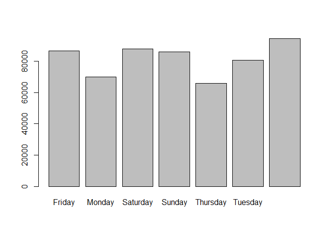

## Introduction

It is now possible to collect a large amount of data about personal movement using activity monitoring devices such as a Fitbit, Nike Fuelband, or Jawbone Up. These type of devices are part of the “quantified self” movement – a group of enthusiasts who take measurements about themselves regularly to improve their health, to find patterns in their behavior, or because they are tech geeks. But these data remain under-utilized both because the raw data are hard to obtain and there is a lack of statistical methods and software for processing and interpreting the data.

This assignment makes use of data from a personal activity monitoring device. This device collects data at 5 minute intervals through out the day. The data consists of two months of data from an anonymous individual collected during the months of October and November, 2012 and include the number of steps taken in 5 minute intervals each day.

The data for this assignment can be downloaded from the course web site:

Dataset: Activity monitoring data [52K]
The variables included in this dataset are:

steps: Number of steps taking in a 5-minute interval (missing values are coded as \color{red}{\verb|NA|}NA)
date: The date on which the measurement was taken in YYYY-MM-DD format
interval: Identifier for the 5-minute interval in which measurement was taken
The dataset is stored in a comma-separated-value (CSV) file and there are a total of 17,568 observations in this dataset

## Loading and preprocessing the data

```r
activity <- read.csv('C://Users/Coquin/Documents/R Scripts/activity-monitoring-data/activity.csv')
head(activity, 10)
```

```
##    steps       date interval
## 1     NA 2012-10-01        0
## 2     NA 2012-10-01        5
## 3     NA 2012-10-01       10
## 4     NA 2012-10-01       15
## 5     NA 2012-10-01       20
## 6     NA 2012-10-01       25
## 7     NA 2012-10-01       30
## 8     NA 2012-10-01       35
## 9     NA 2012-10-01       40
## 10    NA 2012-10-01       45
```
## What is mean total number of steps taken per day?

This table shows the maximum, mean, median, and total number of steps per date.


```r
library(dplyr)
```

```
## 
## Attaching package: 'dplyr'
```

```
## The following objects are masked from 'package:stats':
## 
##     filter, lag
```

```
## The following objects are masked from 'package:base':
## 
##     intersect, setdiff, setequal, union
```

```r
by_date <- activity %>% group_by(date)
vals_per_day <- by_date %>% summarise(max_steps = max(steps, na.rm = TRUE), mean_steps = mean(steps, na.rm = TRUE), median_steps = median(steps, na.rm = TRUE), total_steps = sum(steps, na.rm = TRUE))
head(vals_per_day, 7)
```

```
## # A tibble: 7 x 5
##   date       max_steps mean_steps median_steps total_steps
##   <fct>          <dbl>      <dbl>        <dbl>       <int>
## 1 2012-10-01      -Inf    NaN               NA           0
## 2 2012-10-02       117      0.438            0         126
## 3 2012-10-03       613     39.4              0       11352
## 4 2012-10-04       547     42.1              0       12116
## 5 2012-10-05       555     46.2              0       13294
## 6 2012-10-06       526     53.5              0       15420
## 7 2012-10-07       523     38.2              0       11015
```

This table shows the maximum, mean, median, and total number of steps per weekdays including weekends.


```r
vals_per_day$date <- weekdays(as.Date(vals_per_day$date))
vals_per_weekday <- vals_per_day %>% group_by(date) %>% summarise(max_steps = max(total_steps, na.rm = TRUE), mean_steps = mean(total_steps, na.rm = TRUE), median_steps = median(total_steps, na.rm = TRUE), total_steps = sum(total_steps, na.rm = TRUE))
head(vals_per_weekday,7)
```

```
## # A tibble: 7 x 5
##   date      max_steps mean_steps median_steps total_steps
##   <chr>         <int>      <dbl>        <dbl>       <int>
## 1 Friday        21194      9613.       10600        86518
## 2 Monday        13460      7758.       10139        69824
## 3 Saturday      15420     10968.       11498.       87748
## 4 Sunday        15110     10743        11646        85944
## 5 Thursday      20427      7300.        7047        65702
## 6 Tuesday       15084      8950.        8918        80546
## 7 Wednesday     15414     10481.       11352        94326
```

### Histogram of the steps per weekday across the data

We plot a total steps across all weekdays


```r
barplot(vals_per_weekday$total_steps, names.arg = vals_per_weekday$date, ylab = "Number of steps", xlab = "Days", main = "Total number of steps across all weekdays")
```

<!-- -->

## What is the average daily activity pattern?

Group the dataset by date and interval to calculate the variables of interest.


```r
temp <- activity
temp$date <- weekdays(as.Date(temp$date))
by_date_interval <- temp %>% group_by(date, interval) %>% summarise(max_steps = max(steps, na.rm = TRUE), mean_steps = mean(steps, na.rm = TRUE), median_steps = median(steps, na.rm = TRUE), sum_steps = sum(steps, na.rm = TRUE))
head(by_date_interval)
```

```
## # A tibble: 6 x 6
## # Groups:   date [1]
##   date   interval max_steps mean_steps median_steps sum_steps
##   <chr>     <int>     <int>      <dbl>        <dbl>     <int>
## 1 Friday        0         0          0            0         0
## 2 Friday        5         0          0            0         0
## 3 Friday       10         0          0            0         0
## 4 Friday       15         0          0            0         0
## 5 Friday       20         0          0            0         0
## 6 Friday       25         0          0            0         0
```

Plot the data by 5-minute interval across all weekdays


```r
library(ggplot2)
ggplot(by_date_interval, aes(interval, sum_steps, colour = date)) + geom_line() + facet_wrap(~date, nrow = 7)
```

<!-- -->
## Imputing missing values

Using summary to show if the dataset contains NA's and in which columns there are.


```r
summary(activity)
```

```
##      steps                date          interval     
##  Min.   :  0.00   2012-10-01:  288   Min.   :   0.0  
##  1st Qu.:  0.00   2012-10-02:  288   1st Qu.: 588.8  
##  Median :  0.00   2012-10-03:  288   Median :1177.5  
##  Mean   : 37.38   2012-10-04:  288   Mean   :1177.5  
##  3rd Qu.: 12.00   2012-10-05:  288   3rd Qu.:1766.2  
##  Max.   :806.00   2012-10-06:  288   Max.   :2355.0  
##  NA's   :2304     (Other)   :15840
```
Imputing values with the mean of column "steps"


```r
activity_impute <- activity
activity_impute$steps[is.na(activity_impute$steps)] <- mean(activity_impute$steps, na.rm = TRUE)
```

We show again the values for the variables calculated above to show the differences between them.


```r
library(dplyr)
by_date <- activity_impute %>% group_by(date)
vals_per_day_imput <- by_date %>% summarise(max_steps = max(steps, na.rm = TRUE), mean_steps = mean(steps, na.rm = TRUE), median_steps = median(steps, na.rm = TRUE), sum_steps = sum(steps, na.rm = TRUE))
head(vals_per_day_imput, 7)
```

```
## # A tibble: 7 x 5
##   date       max_steps mean_steps median_steps sum_steps
##   <fct>          <dbl>      <dbl>        <dbl>     <dbl>
## 1 2012-10-01      37.4     37.4           37.4    10766.
## 2 2012-10-02     117        0.438          0        126 
## 3 2012-10-03     613       39.4            0      11352 
## 4 2012-10-04     547       42.1            0      12116 
## 5 2012-10-05     555       46.2            0      13294 
## 6 2012-10-06     526       53.5            0      15420 
## 7 2012-10-07     523       38.2            0      11015
```

There is not a big difference between the values, only fist day its affected.


```r
vals_per_day_imput$date <- weekdays(as.Date(vals_per_day_imput$date))
vals_per_weekday_imput <- vals_per_day %>% group_by(date) %>% summarise(max_steps = max(total_steps, na.rm = TRUE), mean_steps = mean(total_steps, na.rm = TRUE), median_steps = median(total_steps, na.rm = TRUE), total_steps = sum(total_steps, na.rm = TRUE))
head(vals_per_weekday_imput,7)
```

```
## # A tibble: 7 x 5
##   date      max_steps mean_steps median_steps total_steps
##   <chr>         <int>      <dbl>        <dbl>       <int>
## 1 Friday        21194      9613.       10600        86518
## 2 Monday        13460      7758.       10139        69824
## 3 Saturday      15420     10968.       11498.       87748
## 4 Sunday        15110     10743        11646        85944
## 5 Thursday      20427      7300.        7047        65702
## 6 Tuesday       15084      8950.        8918        80546
## 7 Wednesday     15414     10481.       11352        94326
```


```r
barplot(vals_per_weekday_imput$total_steps, names.arg = vals_per_weekday_imput$date)
```

<!-- -->


```r
temp <- activity_impute
temp$date <- weekdays(as.Date(temp$date))
by_date_interval <- temp %>% group_by(date, interval) %>% summarise(max_steps = max(steps, na.rm = TRUE), mean_steps = mean(steps, na.rm = TRUE), median_steps = median(steps, na.rm = TRUE), sum_steps = sum(steps, na.rm = TRUE))
head(by_date_interval)
```

```
## # A tibble: 6 x 6
## # Groups:   date [1]
##   date   interval max_steps mean_steps median_steps sum_steps
##   <chr>     <int>     <dbl>      <dbl>        <dbl>     <dbl>
## 1 Friday        0      37.4       8.31            0      74.8
## 2 Friday        5      37.4       8.31            0      74.8
## 3 Friday       10      37.4       8.31            0      74.8
## 4 Friday       15      37.4       8.31            0      74.8
## 5 Friday       20      37.4       8.31            0      74.8
## 6 Friday       25      37.4       8.31            0      74.8
```


```r
library(ggplot2)
ggplot(by_date_interval, aes(interval, sum_steps, colour = date)) + geom_line() + facet_wrap(~date, nrow = 7)
```

<!-- -->


```r
summary(activity_impute)
```

```
##      steps                date          interval     
##  Min.   :  0.00   2012-10-01:  288   Min.   :   0.0  
##  1st Qu.:  0.00   2012-10-02:  288   1st Qu.: 588.8  
##  Median :  0.00   2012-10-03:  288   Median :1177.5  
##  Mean   : 37.38   2012-10-04:  288   Mean   :1177.5  
##  3rd Qu.: 37.38   2012-10-05:  288   3rd Qu.:1766.2  
##  Max.   :806.00   2012-10-06:  288   Max.   :2355.0  
##                   (Other)   :15840
```

## Are there differences in activity patterns between weekdays and weekends?

The difference in activities shown by the graphics demonstrate that there are more activities during the weekday that weekends and its more large.


```r
by_date_interval$date <- factor(as.character(by_date_interval$date), levels = c("Monday","Tuesday","Wednesday", "Thursday","Friday", "Saturday", "Sunday"), labels= c("week", "week", "week", "week", "week", "weekend", "weekend"))
```


```r
library(ggplot2)
ggplot(by_date_interval, aes(interval, sum_steps, colour = date)) + geom_line() + facet_wrap(~date, nrow = 7)
```

<!-- -->
